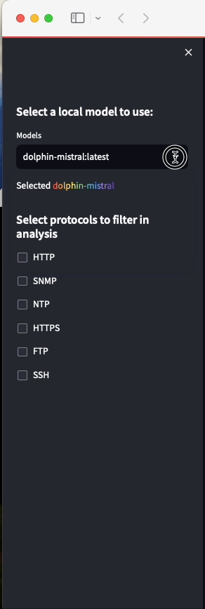
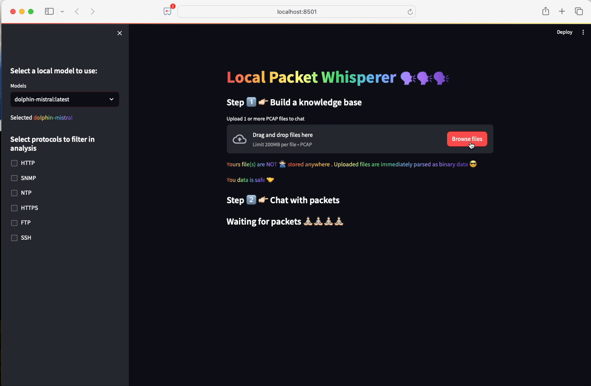
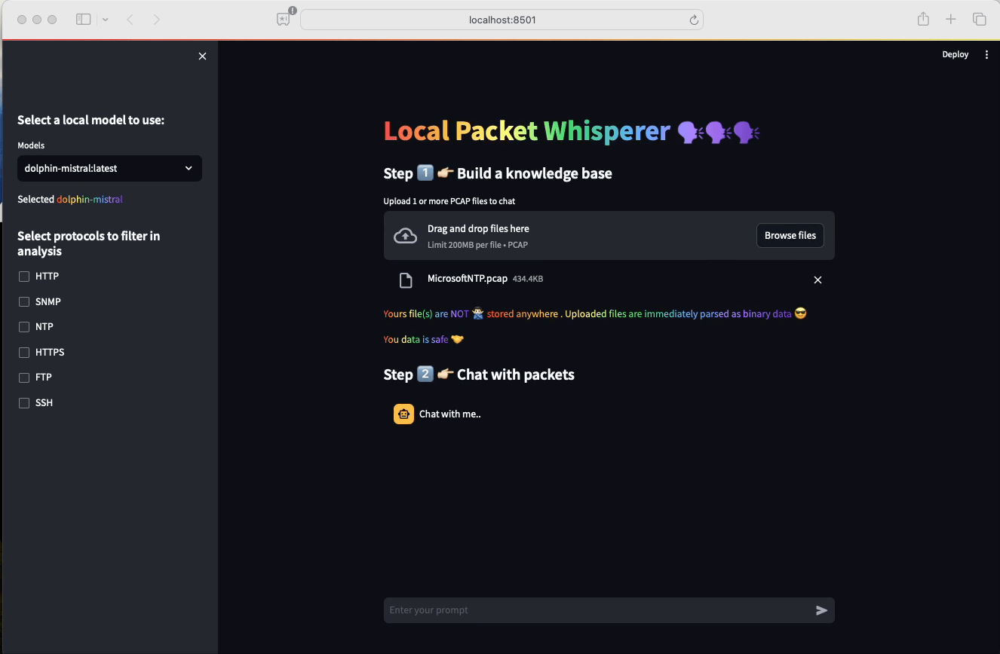
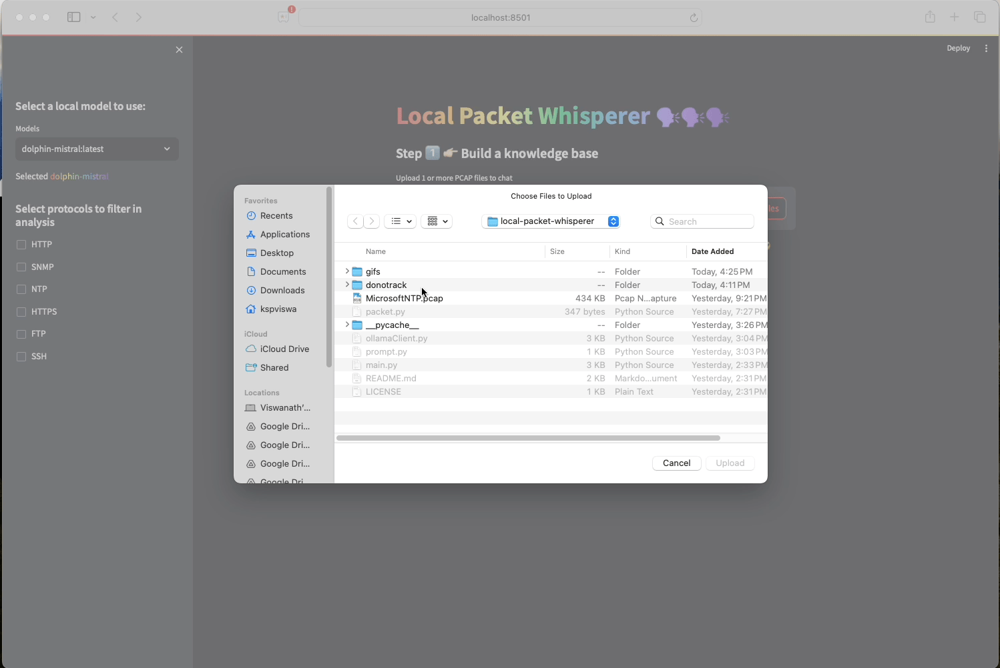

# Local Packet Whisperer (LPW)

### A Fun project using [Ollama](https://github.com/ollama), [Streamlit](https://streamlit.io) & [PyShark](https://github.com/KimiNewt/pyshark) to chat with PCAP files locally, privately!

## Features & Background

1) 100% local, private PCAP assistant powered by range of local LLMs at your control, powered by Ollama
2) Purely based on promp engg without any fancy libraries & dependencies. 100% vanilla
3) Uses streamlit for the FE and pyshark for the pcap parsing needs

## Requirements

1) Download & Install [Ollama](https://ollama.ai) by referring to instructions according to your OS [here](https://ollama.com/download)

2) Pull any Chat based LLM models to use with LPW.
```
ollama pull dolphin-mistral:latest
```
3) If not running the desktop application, Start Ollama Server (refer [here](https://github.com/ollama/ollama?tab=readme-ov-file#start-ollama))

4) Clone this repo and install requirements
```
git clone https://github.com/kspviswa/local-packet-whisperer.git
python3 -m venv .venv
source .venv/bin/activate
pip install -r requirements.txt
```

## Usage

1) Run streamlit app & point to `http://localhost:8501`
```
stream run main.py
```

2) LPW will automatically fetch the local models from Ollama local repo and populate the dropdown. Select a model to start your test. You can play with more than 1 model to compare the results 😎



3) Now upload a PCAP file. *PS: Though LPW accepts more than 1 file, currently only the first file will be used for analysis*



4) You can now start to chat with LPW and ask questions about the packet. **Please Note: The performance of LPW depends on the underlying model. So feel free to download as many local LLMs from Ollama and try it.** It is fun to see different response 🤩🤩🤩.


*(This is a long gif. You will find LLM response at the end of the gif)*

5) By default *PyShark* parse the pcap till transport layer. If you want, you can help the LLM to parse application layer by selecting protocol filter in the analysis *(just like how we would do in wireshark)* .



## Contributions

I just created this project based on inspiration from similar project called [Packet Buddy](https://github.com/automateyournetwork/packet_buddy) which used open AI. But if you find this useful and wanna contribute bug fixes, additional features feel free to do so by raising a PR or open issues for me to fix. I intend to work on this as a hobby unless there is some interest in the community.